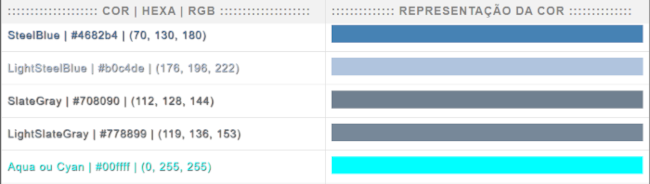

# Some projects in Python language

>### Course Projects "Programação em Python do básico ao avançado" - Geek University | Udemy
> - Cores (with python, html, css and javascript) - [Click here](https://alexandrelorena.github.io/projetos-em-python/cores/cores_table.html) or in the image to test the browser
> 
> 
>    
>
> - Banco
> - Game
> - Mercado
>
> #### Other projects (coming soon...)

   &nbsp;&nbsp;
     &nbsp;&nbsp;
    &nbsp;&nbsp;
    &nbsp;&nbsp;
    &nbsp;&nbsp;
    &nbsp;&nbsp;
     

  
  
  

